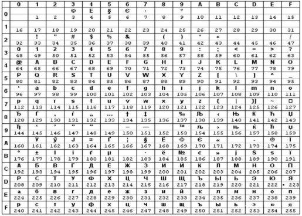

Министерство образования Республики Беларусь

Учреждение образования «БЕЛОРУССКИЙ

ГОСУДАРСТВЕННЫЙ ТЕХНОЛОГИЧЕСКИЙ УНИВЕРСИТЕТ»

Факультет          	Информационных технологий					

Кафедра              	Программной инженерии						

Специальность 	6-05-0612-01 Программная инженерия. 				

Профилизация: 	Программное обеспечение информационных технологий	

**ПОЯСНИТЕЛЬНАЯ ЗАПИСКА**

**КУРСОВОГО ПРОЕКТА НА ТЕМУ:**

`			        `«Разработка компилятора LSA-2025»			

Выполнил студент 			     	 			        Лавшук С.А.

`     `курс, группа	               подпись	                   (Ф.И.О. студента)

Руководитель проекта 				 			       Авдеева В.Д.

(учен. степень, звание, должность, подпись, Ф.И.О. руководителя)

Заведующий кафедрой 						к.т.н., доц. Смелов В.В.	

(учен. степень, звание, должность, подпись, Ф.И.О.)

Консультанты 						     		       Авдеева В.Д.

(учен. степень, звание, должность, подпись, Ф.И.О.)

Курсовой проект защищен с оценкой 							

Минск 2025
# **Введение**
Целью настоящего курсового проекта является создание полноценного транслятора для языка программирования LSA-2025, который позволит глубже понять процессы компиляции и интерпретации кода, а также освоить методы анализа и генерации программ. В эпоху быстрого развития технологий, когда языки программирования эволюционируют, чтобы соответствовать новым требованиям производительности, безопасности и удобства использования, разработка собственного транслятора становится не просто академическим упражнением, а реальным вкладом в понимание основ компьютерных наук. 

Чтобы поставленная цель была достигнута необходимо сформулировать задачи:

- cоздание лексического анализатора с использованием конечных автоматов;
- cоздание синтаксического анализатора при помощи автоматов с магазинной памятью;
- создание подпрограммы, преобразовывающую выражения в форму обратной польской записи;
- создание семантического анализатора;
- создание генератора объектного кода, применяющего язык программирования Assembler.

# **Спецификация языка программирования**
## **1.1. Характеристика языка программирования**
Язык программирования LSA-2025 является компилируемым, низкоуровневым, строго типизированным. Поддерживается написание кода в императивном стиле.
## **1.2. Определение алфавита языка программирования**
Алфавит языка программирования LSA-2025 сформирован на основе символов таблицы кодировки Windows-1251, были определены, русские и латинские буквы, цифры, сепараторы, операторы, пробельные символы, символы времени исполнения. Описание алфавита представлено в БНФ в таблице 1.1.

Таблица 1.1 – Алфавит языка программирования LSA-2025

|<алфавит> ::= <символ-исходного-кода> | <символ-времени-исполнения>|
| - |
|<символ-исходного-кода> ::= <буква> | <цифра> | <разделитель> | <оператор>|
|<буква> ::= 'A'..'Z' | 'a'..'z' | '\_'|
|<цифра> ::= '0'..'9'|
|<разделитель> ::= ';' | '(' | ')' | '{' | '}' | '[' | ']' | <кавычки> | <пробел>|
|<оператор> ::= '+' | '-' | '\*' | '/' | '=' | '<' | '>' | '~' | "++" | "--"|
|<кавычка> ::= '\''|
|<пробел> ::= ' ' | '\t' | '\n'|
|<комментарий> ::= '//' { <символ-исходного-кода> } '\n'|
|<символ-времени-исполнения> ::= <символ-windows-1251>|
|<символ-windows-1251> ::= любой байт с кодом 0x20–0xFF, кроме управляющих символов 0x00–0x1F|

Таким образом, алфавит языка предоставляет возможность использовать символы английского и русского языков в любом регистре, символы разделителей, арифметических операций, операций сравнения, инверсии, инкремента, декремента.
## **1.3. Применяемые сепараторы**
Исходя из вышеописанного алфавита языка можно заметить, что сепараторами являются символы, подчиняющиеся правилу нетерминального символа <разделитель>. 
### **1.3.1. Правила применения**
Правила применения явно вытекают из функции сепаратора в исходном коде (таблица 1.2). Если сепаратор используется не для применения заданной ему функции, компиляция исходного кода завершится с кодом XXX

Табл. 1.2 Функции символов сепараторов языка LSA-2025

|Сепаратор|Функция|
| :-: | :-: |
|;|Разделение инструкций и выражений|
|(|Начало блока аргументов функции, границы выражения|
|)|Конец блока аргументов функции, границы выражения|
|{|Начало логического блока исходного кода|
|}|Конец логического блока исходного кода|
|'|Определение символьного и строгового литерала|
|//|Определение строки-комментария|
|пробел, \n|Разделение лексем. |

Приведенные сепараторы формируют базовый каркас для лексического анализатора, позволяя ему однозначно выделять в потоке символов такие значимые элементы, как ключевые слова, идентификаторы и литералы. Четкое определение и недвусмысленная роль каждого сепаратора исключают возможность их конфликта с другими лексемами, что является критически важным для надежной работы транслятора.
## **1.4. Применяемые кодировки**
Язык программирования LSA-2025 использует кодировку Windows-1251 (рис 1.1).

Рисунок 1.1 – Таблица кодировки Windows-1251

Кодировка Windows-1251 обеспечивает однозначное распознавание всех символов алфавита языка транслятором и гарантирует корректную работу с кириллическими символами. Этот выбор упрощает лексический анализ и обеспечивает совместимость со средами, где данная кодировка является системной.
## **1.5. Типы данных**
В языке LSA-2025 разрешены типы данных, описанные в табл. 1.3.

Таблица 1.3 – Типы данных языка LSA-2025 

|Тип|Описание|
| :-: | :-: |
|unsigned integer|Целочисленный, беззнаковый тип данных.|
|char|Символьный тип данных. Использует символы русского и английского языка, доступные в кодировке Windows-1251.|
|logic|Логический тип данных. Представляется в памяти как 1 (истинно) и 0 (ложно). Применимы операции сравнения.|

Система типов LSA-2025 включает два базовых типа: unsigned integer для целочисленных операций и char для работы с символами. Создание пользовательских типов данных не поддерживается.
## **1.6. Преобразование типов данных**
Контроль типов происходит на этапе компиляции. Разрешено приведение типа char в unsigned integer. Остальные преобразования запрещены и будут вызывать ошибку компиляции. 
## **1.7. Идентификаторы**
В языке программирования LSA-2025 разрешено использовать идентификаторы. Максимальная длина идентификатора – 16 символов. При превышении длины идентификатора определено исключение компилятора, означающее остановку работы программы.

Таблица 1.4 – Идентификаторы в LSA-2025

|<идентификатор> ::= <буква> { <буква> | <цифра> }|
| - |
|<буква> ::= 'A' | ... | 'Z' | 'a' | ... | 'z' | 'А' | ... | 'Я' | 'а' | ... | 'я'|
|<цифра> ::= '0' | '1' | '2' | '3' | '4' | '5' | '6' | '7' | '8' | '9' |

Наглядные примеры правильного и неправильного использования были описаны в листинге 1.1.

|
// Правильно

unsigned integer iFirst;

char ch;

// Неправильно

unsigned integer 1+\_45;

unsigned integer \_125;

unsigned integer integer;

char char;

char \_\_\_;
|
| :- |

Листинг 1.1 – Пример использования идентификаторов

Запрещается использовать в качестве идентификатора зарезервированные ключевые слова языка. Первый символ идентификатор обязательно должен являться буквой.
### **1.8. Литералы**
В языке программирования LSA-2025 поддерживаются литералы для типов данных unsigned integer и char. Литералы представляют собой константные значения, которые могут быть использованы в выражениях, инициализации переменных и других конструкциях языка.
### **1.8.1. Целочисленные литералы**
Целые литералы представляют беззнаковые целочисленные значения. Они могут быть записаны в десятичной или шестнадцатеричной форме.

Примеры правильного и неправильного использования целочисленных литералов были описаны в листинге 1.2.

|
// Правильно

42

0

0x1A

0XFFFF

// Неправильно

-5

0xG

5FA
|
| :- |

Листинг 1.2 – Пример использования целочисленных литералов

Десятичные литералы: последовательность цифр от 0 до 9, начинающаяся с ненулевой цифры (за исключением литерала 0). Диапазон значений соответствует диапазону от 0 до 4294967295.

Шестнадцатеричные литералы: начинаются с префикса "0x", за которым следует последовательность цифр от 0 до 9 и букв от A до F (или a до f). Шестнадцатеричные литералы также интерпретируются как беззнаковые целые.
### **1.8.2 Символьные литералы**
Символьные литералы представляют одиночные символы из кодировки Windows-1251. Они заключаются в одинарные кавычки (' '). 

Примеры правильного и неправильного использования символьных литералов были показаны в листинге 1.3.

|
// Правильно

'A'

'1'

'\n'

// Неправильно

A

'\r'

'A\n'
|
| :- |

Листинг 1.3 – Пример использования символьных литералов

Поддерживаются стандартные спец. символы, такие как '\n' (новая строка).
## **1.9. Объявление данных**
Объявление данных позволяет определять переменные и их типы для использования в программе. Объявление должно строго соответствовать правилам языка, включая указание типа данных и идентификатора.

Примеры правильного и неправильного объявления данных показаны в соответствующих листинге 1.4.

|
// Правильно

unsigned integer a;

unsigned integer abc;

char ch;

// Неправильно

uint a;

int a;

ch char;

char a, b, c;
|
| :- |

Листинг 1.4 – Пример объявления данных

Объявление переменной состоит из ключевого слова, обозначающего тип данных, за которым следует идентификатор переменной. За типом данных может стоять только один идентификатор переменной.
## **1.10 Инициализация данных**
Переменные могут быть инициализированы при объявлении с использованием оператора присваивания (=). Примеры правильной и неправильный инициализации данных были представлены в листинге 1.5.

|
// Правильно

unsigned integer a = 10;

unsigned integer b = 0xFF;

char ch = 'A';

// Неправильно

unsigned integer b = A;

unsigned integer c 103;

char ch = 'AWEQWF';

char ch2 = "A";
|
| :- |

Листинг 1.5 – Пример инициализации данных

Важно отметить, что значение должно быть совместимым с типом переменной.
## **1.11 Инструкции языка**
В языке программирования LSA-2025 инструкции (операторы) определяют действия, выполняемые программой. Язык поддерживает императивный стиль, где программа состоит из последовательности инструкций. Инструкции могут быть простыми (например, присваивание) или составными (например, цикл). Каждая инструкция заканчивается точкой с запятой (;), если не является блоком кода. Все возможные инструкции языка описаны в таблице 1.5.

Таблица 1.5 – Инструкции языка

|Инструкция языка|Синтаксис|
| :-: | :-: |
|Использование переменной|
<идентификатор> = <операция>;

<идентификатор>(<идентификатор>, ...);
|
|Использование функции|<идентификатор>(<идентификатор>, ...);|
|Точка входа в программу|
main {

тело функции

send <идентификатор>|<литерал>;

}
|
|Условный оператор|
if (<логическое выражение>) {...}

if (<логическое выражение>) {...}

differ {...}
|
|Оператор цикла со счётчиком|because (<инициализация переменной>; <логическое выражение>; <операция>) {...}|

Данный набор инструкций формирует минимальную достаточную основу языка. Их строгий синтаксис гарантирует однозначный разбор транслятором.

## **1.12 Операции языка**
Операции могут выполняться над одним операндом (унарные), либо над двумя (бинарные). Результат будет иметь такой же тип данных, как и операнды, за исключением случая, когда char преобразуется в unsigned integer. Описание каждой операции, существующей в языке программирования LSA-2025 представлено в таблице 1.6.

Таблица 1.6 – Операции языка

|Тип|Категория|Оператор|Пояснение|
| :-: | :-: | :-: | :-: |
|Унарные|Арифметические|Инкремент (++)|Увеличивает значение на 1. Может быть префиксный и постфиксный.|
|||Декремент (--)|Уменьшает значение на 1. Может быть префиксный и постфиксный.|
||Побитовые|Инверсия (~)|
Побитовое логическое NOT. Применяется только к unsigned integer.

|
|Бинарные|Арифметические|Сложение (+)|Базовые операции с числами. Применимы только к unsigned integer.|
|||Умножение (\*)||
|||Вычитание (-)||
|||Деление (:)||
||Сравнения|Равно (==)|Базовые операции для сравнения двух операндов. Применимы для unsigned integer и logic типам.|
|||Не равно (!=)||
|||Меньше (<)||
|||Больше (>)||
|||Меньше или равно (<=)||
|||Больше или равно (>=)||
Приоритет операций определяется согласно классическому математическому представлению, где умножение и деление стоят в приоритете выше, чем сложение и вычитание. Остальные операции имеют одинаковый приоритет. Явно указать приоритет операций можно при помощи круглых скобок.

При одинаковом приоритете операции выполняются в порядке слева направо. 

## **1.13 Выражения**
Выражения – это комбинации литералов, идентификаторов, операторов и вызовов функций, которые вычисляются до значения. Выражения имеют тип, соответствующий типам данных unsigned integer или char. Поддерживаются унарные и бинарные операции, а также вызовы функций стандартной библиотеки.

Выражения читаются слева направо, а также должны быть записаны в одну строку. Могут присутствовать операнды только из одной категории, а также вызовы функций. Можно использовать круглые скобки для изменения приоритета операций.
## **1.14 Конструкции языка**
Язык LSA-2025 поддерживает следующие базовые конструкции управления: точку входа main, пользовательские функции, цикл со счётчиком because и условный оператор if ... differ. Эти конструкции образуют минимально необходимый набор для управления потоком выполнения.

Таблица 1.7 – Конструкции языка

|Конструкция|Синтаксис|
| :-: | :-: |
|Точка входа (main)|
main {

...

send <идентификатор>|<литерал>;

}
|
|Пользовательская функция|
func <тип данных><идентификатор>(<тип данных><идентификатор>, ...) {

...

send <идентификатор>|<литерал>;

}
|
|Цикл со счётчиком|because (<инициализация переменной>; <логическое выражение>; <операция>) {...}|
|Условный оператор|
if (<логическое выражение>) {...}

или

if (<логическое выражение>) {...}

differ {...}
|

Функция должна обязательно возвращать значения, но не больше чем одно. Для вызова пользовательской функции нужно указать её имя, а в круглых скобках через запятую перечислить параметры. Функции стандартной библиотеки вызываются аналогично пользовательским, но определы в языке программирования по умолчанию. Главная функция должна возвращать код, с которым завершилось выполнение программы.
## **1.15 Область видимости идентификаторов**
Все идентификаторы, кроме идентификаторов пользовательских функций имеют область видимости внутри конструкции. Идентификаторы пользовательских функций имеют глобальную область видимости.
## **1.16 Семантические проверки**
Семантический анализ обеспечивает корректность программы поверх синтаксиса. Он проверяет контекстную согласованность операций и типов данных. Все сематнические проверки языка программирования LSA-2025 описаны в таблице 1.8.

Таблица 1.8 – Семантические проверки

|п/п|Правило|
| - | :-: |
|1|Должна присутствовать точка входа в программу (main)|
|2|Функция main может быть только одна|
|3|Типы параметров вызывающего и вызываемого кода в пользовательских функциях должны соответствовать|
|4|Нельзя использовать необъявленные переменные|
|5|Возвращаемое значение пользовательской функции должно совпадать с ее объявленным типом|
|6|Объявления всех функций должны быть сделаны перед точкой входа в программу|
|7|Никакой идентификатор не может совпадать с ключевыми словами языка программирования|
|8|Тип присваемого переменной значения должен совпадать с типом самой переменной|
|9|Все блоки кода должны иметь закрывающую скобку и должны быть выделены корректным образом|
|10|Нельзя повторно объявлять переменную в одной и той же области видимости|
|11|Нельзя делить на 0|

Эти правила гарантируют, что синтаксически правильная программа будет иметь осмысленное и предсказуемое поведение.
## **1.17 Распределение оперативной памяти на этапе выполнения**
Модель памяти транслятора LSA-2025 использует две основные области:

- Сегмент констант: содержит все литералы программы (целочисленные и символьные)
- Сегмент данных: содержит все объявленные переменные (unsigned integer, char, logic)

Для хранения промежуточных результатов вычислений используется основной стек процессора. Все операции с данными выполняются через стековую модель, что обеспечивает единый механизм вычислений для всех поддерживаемых типов данных.
## **1.18 Стандартная библиотека и ее состав**
Стандартная библиотека языка LSA-2025 предоставляет базовые математические и служебные функции. Библиотека подключается автоматически при запуске транслятора и не требует явного импорта.

Состав функций представлен в таблице 1.9.

Таблица 1.9 – Стандартная библиотека LSA-2025

|Вызов функции|Описание|Параметры|Возвращаемое значение|
| :-: | :-: | :-: | :-: |
|sqrt(x)|Вычисление квадратного корня|unsigned integer x|unsigned integer - результат извлечения корня|
|pow(x,y)|Возведение числа в степень|unsigned integer x - основание, unsigned integer y - показатель|unsigned integer - результат возведения в степень|
|isPrime(x)|Проверка, является ли число простым|unsigned integer x - проверяемое число|logic - 1, если простое и 0, если нет|
|toUpper(ch)|Преобразование символа в верхний регистр|char ch - входной символ|char - символ в верхнем регистре|
|getMin(x,y)|Нахождение наименьшего из 2 чисел|unsigned integer x, unsigned integer y|unsigned integer - число, которое оказалось наименьшим|
|getMax(x,y)|Нахождение наибольшего из 2 чисел|unsigned integer x, unsigned integer y|unsigned integer - число, которое оказалось наибольшим|
|readch()|Ввод символа из стандартного потока ввода|-|char - введенный символ|
|writech(ch)|Вывод символы в стандартный поток вывода|char ch - выводимый символ|-|

Вызов таких функций осуществляется так же, как и вызов пользовательских функций. Проверка типов данных аргументов осуществляется на этапе семантического анализа.

Содержащиеся в стандартной библиотеке функции написаны на языке C++.
## **1.19 Ввод и вывод данных**
Для организации базового взаимодействия с пользователем язык LSA-2025 предоставляет две функции ввода-вывода, работающие со стандартными потоками: readch(), writech(). В качестве аргумента могут быть переданы идентификатор переменной, либо литерал.

Функции управления вводом и выводом реализованы на C++. На этапе генерации кода операторы управления стандартным потоком в LSA-2025 заменяются на встроенные функции stl языка C++.
## **1.20 Точка входа**
В языке программирования LSA-2025 точкой входа было выбрано ключевое слово main. Определить main необходимо, однако только один раз. А также main должно возвращать значение типа unsigned integer.
## **1.21 Препроцессор**
Препроцессор не предусмотрен, т.к. нет операций импорта других файлов.
## **1.22 Соглашение о вызовах**
Использовано стандартное соглашения о вызовах, определяющее, что все параметры функции будут передаваться справа налево через стек. Память освобождается вызываемым кодом.
## **1.23 Объектный код**
Программа, написанная на LSA-2025 транслируется в ассемблерный код, а после – в объектный.
## **1.24 Классификация сообщений транслятора**
Сообщения об ошибках выводятся в файл протокола и консоль. Определение сообщений ошибок представлены в таблице 1.10.

Таблица 1.10 – Классификация ошибок (другие коды)

|Коды ошибок|Описание|
| :-: | :-: |
|0-99|Системные ошибки|
|100-110|Ошибки параметров|
|111-125|Ошибки лексического анализатора|
|126-136|Ошибки семантического анализа|
|600-610|Ошибки синтаксического анализа|

При выводе сообщения об ошибке, транслятор прекращает работу. Максимальное количество одновременно выведенных ошибок – 3.
## **1.25 Контрольный пример**
Контрольный пример исчерпывающе описывает возможности языка программирования LSA-2025. Используется для отладки работы транслятора. Исходный код контрольного примера можно видеть в листинге 1.6.

|
func unsigned integer factorial(unsigned integer n) {

`    `if (n == 0) {

`        `send 1;

`    `}

`    `differ {

`        `unsigned integer result = 1;

`        `unsigned integer i = 1;

`        `because (i = 1; i <= n; i++) {

`            `result = result \* i;

`        `}

`        `send result;

`    `}

}

func char processChar(char c) {

`    `char upperC = toUpper(c);

`    `send upperC;

}

// Тестовый комментарий

main {

`    `writech('H');

`    `writech('e');

`    `writech('l');

`    `writech('l');

`    `writech('o');

`    `writech(',');

writech(' ');

writech('W');

`    `writech('o');

`    `writech('r');

`    `writech('l');

writech('d');

`    `writech('!');

`    `unsigned integer x = 5;

`    `unsigned integer y = 0xA;

`    `char symbol = 'h';

    

`    `unsigned integer sum = x + y;

unsigned integer product = x \* y;

unsigned integer divide = x : y;

    

`    `x++;

`    `y--;

`    `unsigned integer inverted = ~y;

    

`    `unsigned integer fact = factorial(x);

    

`    `unsigned integer power = pow(2, 8);

`    `unsigned integer root = sqrt(256);

`    `unsigned integer isPrimeNum = isPrime(17);

    

`    `char processed = processChar(symbol);

    

`    `unsigned integer maxVal = getMax(x, y);

`    `unsigned integer minVal = getMin(x, y);

    

`    `if (x > y) {

`        `unsigned integer diff = x - y;

`    `}

`    `differ {

`        `unsigned integer diff = y - x;

`    `}

    

`    `unsigned integer counter = 0;

`    `because (unsigned integer i = 0; i < 5; i++) {

`        `counter = counter + i;

`    `}

        

`    `char inputChar = readch();

`    `writech(inputChar);

`    `writech('\n');

    

`    `send 0;

}
|
| :- |

Листинг 1.6 – Контрольный пример
